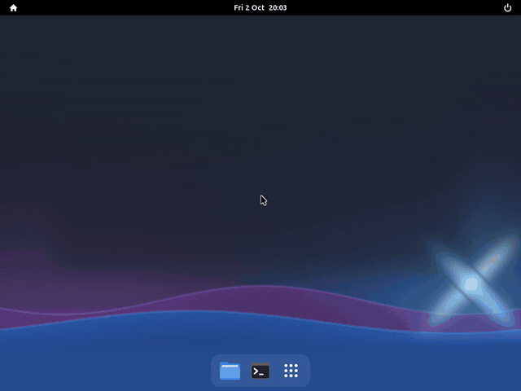
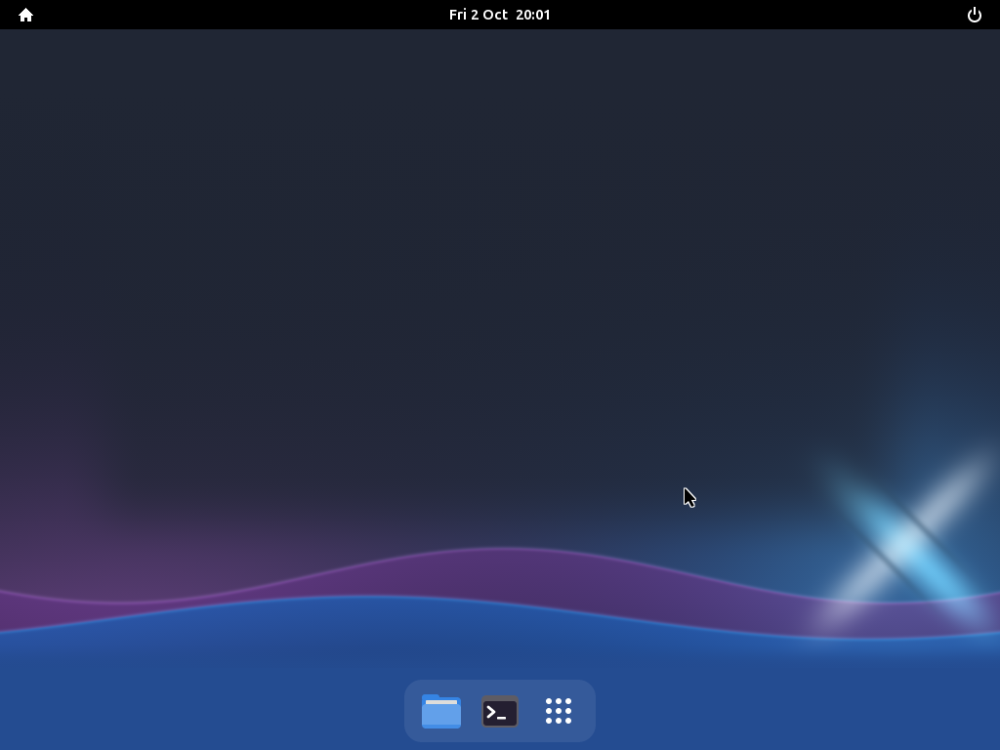
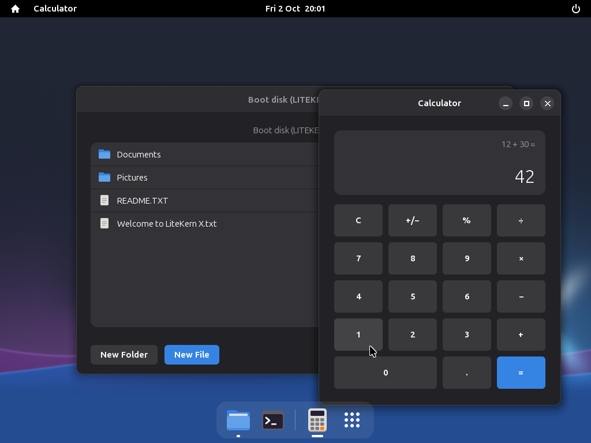
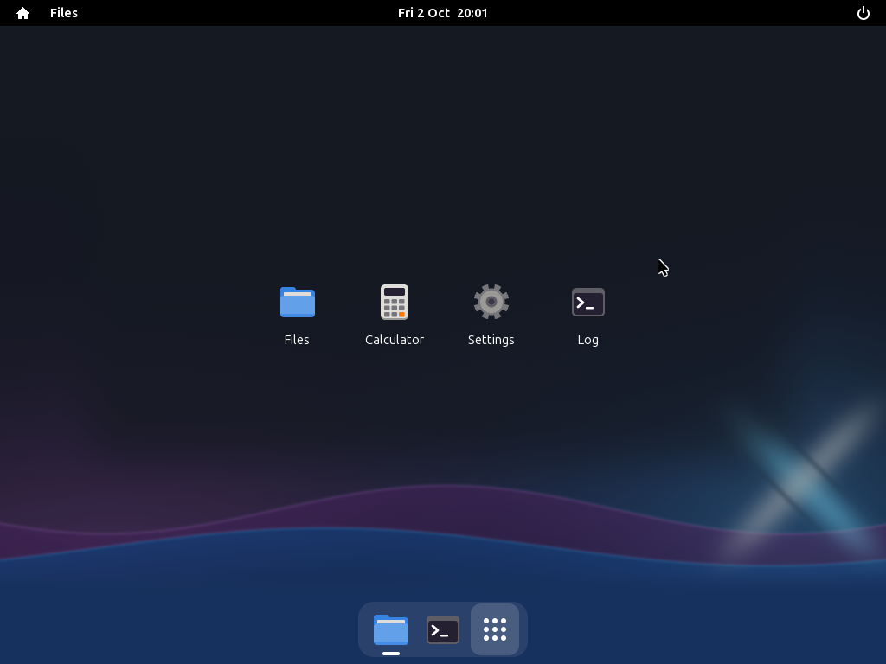
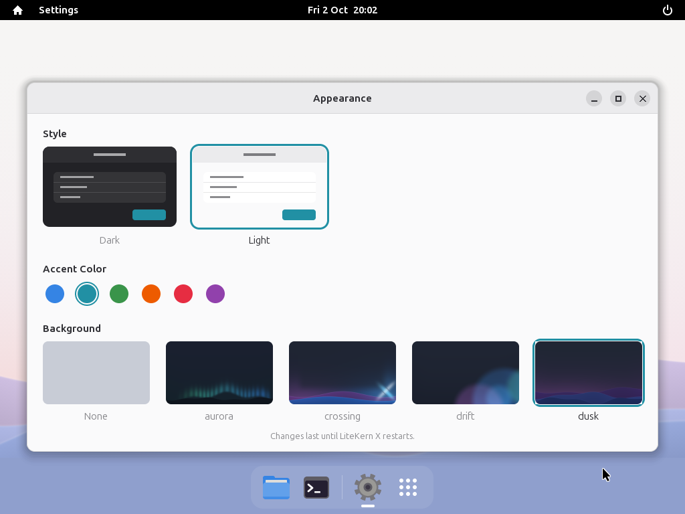

  

<h1 align="center">LiteKern X</h1>

  A small operating system, written from scratch, for the ASUS Eee PC 1000HE netbook.

  

## What is it?

LiteKern X is a complete operating system for one 2009 netbook, the ASUS Eee PC 1000HE. There's no Linux or Windows underneath: everything, from the code that starts the machine to the windows on the screen, is written for this project.

It boots in about a second to a clean, modern desktop with a dock, an app menu, and windows you can move around, like on Windows or GNOME.

## Screenshots

<table>
  <tr>
    <td></td>
    <td></td>
  </tr>
  <tr>
    <td align="center">The desktop</td>
    <td align="center">Two apps at once</td>
  </tr>
  <tr>
    <td></td>
    <td></td>
  </tr>
  <tr>
    <td align="center">The app menu</td>
    <td align="center">Light style, in Settings</td>
  </tr>
</table>

## What it can do

- **Starts fast:** about a second from the boot menu to the desktop.
- **Real windows:** move them, resize them, minimise, maximise or snap them to half the screen, with several apps open at once.
- **A dock and an app menu:** favourites stay in the dock; open apps show a dot underneath.
- **Apps:**
  - **Files** browses the USB stick, makes folders and files, renames and deletes them, and opens text files.
  - **Calculator** does exact decimal sums.
  - **Settings** switches between dark and light, six accent colours and five backgrounds.
  - **Log** shows what the system is doing.
- **Stays up:** if an app crashes or freezes, only that app closes.
- **Shut down and restart** from the power menu.

## Try it

There's no download yet; the first release is coming (see Status). For now you build it yourself on Windows, using WSL:

1. Install [WSL](https://learn.microsoft.com/windows/wsl/install) with Ubuntu.
2. In this folder, open PowerShell and run `wsl sudo bash tools/setup-wsl.sh` once.
3. Run `wsl make run`. LiteKern X starts in a window.

To run it on a real Eee PC 1000HE, see [Testing on the Eee PC](docs/HARDWARE-TEST.md).

## Status

LiteKern X is a work in progress.

- **Done:**
  - Booting on the real Eee PC.
  - The desktop, windows and apps.
  - Themes and wallpapers.
- **Next:**
  - A full test on the real Eee PC.
  - The first release: a download, a website and documentation.
- **Later:**
  - Battery status, sound and USB.

The full plan is in [`LiteKernX-Roadmap/`](LiteKernX-Roadmap/).

## For developers

- [Developing LiteKern X](docs/DEVELOPING.md): building, testing, the VMs and where everything is
- [Making an app](docs/APPS.md): write your own app for LiteKern X
- [The roadmap](LiteKernX-Roadmap/): what's done and what's next

LiteKern X is a clean-slate rewrite of LiteKern v1, keeping its app model (KERN86).
